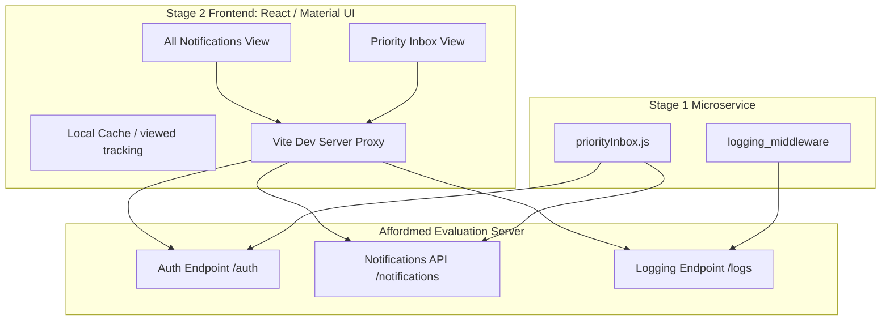

# Notification System Design

## Stage 1

## System Architecture



### Components Interaction

1. **Authentication Flow**: When either the frontend or the backend initializes, it submits ClientID and ClientSecret to the `/auth` endpoint to retrieve a valid JWT access token.
2. **Data Fetching Flow**: The client requests notifications from `/notifications`. For the Priority Inbox, the client retrieves all available notifications and scores them dynamically matching the backend Stage 1 algorithm.
3. **Structured Logging**: All actions and data retrievals invoke the `logging_middleware`, which truncates messages to a maximum of 48 characters to prevent errors and forwards the structured logs to the `/logs` endpoint.

---

### Problem Statement

The campus notifications app has been getting a ton of notifications and users complain they miss the important ones. We need a **Priority Inbox** that surfaces the top N most critical unread notifications first.

### My Approach

I went with a **weighted scoring system** that combines two factors to rank each notification:

1. **Type Weight** — Different notification types carry different importance:
   - `Placement` → weight **3** (highest priority, these are career-critical)
   - `Result` → weight **2** (academic results are important but not urgent like placements)
   - `Event` → weight **1** (nice to know, but lowest urgency)

2. **Recency** — Within the same type, newer notifications should appear first. I convert the timestamp to epoch seconds so I have a numeric value to work with.

### Scoring Formula

```
score = typeWeight * 1e10 + epochSeconds
```

The large multiplier (10 billion) on the type weight guarantees that type always dominates the ranking. A Placement from yesterday will always rank above a Result from today. But two Placements will be ordered by which one is newer.

### How It Handles New Notifications

Since the score is computed on-the-fly every time we fetch, new notifications are automatically incorporated. There's no stale cache to worry about. If a new Placement comes in, it'll slot right into the top because of the weight. If it's an Event, it'll naturally fall to the bottom unless there aren't enough higher-priority items.

### Maintaining Top 10 Efficiently

Right now with ~20 notifications, a full sort is fine (O(n log n) is trivial at this scale). But if the dataset grew to thousands, I'd switch to a **min-heap of size 10** — that gives us O(n log k) where k=10, so essentially O(n). We'd iterate through all notifications once, maintaining a heap of the 10 best scores seen so far. Each insertion/eviction is O(log 10) which is constant.

For the current scale though, sorting the whole array and slicing the top 10 is simpler and plenty fast.

### Code Structure

```
notification_app_be/
  priorityInbox.js    <- main Stage 1 script
logging_middleware/
  index.js            <- reusable Log() function with auto-token-refresh
```

### How to Run

```bash
cd notification_app_be
node priorityInbox.js
```

### Output

The script prints a formatted table showing:
- Rank position (#1 through #10)
- Notification type with its weight
- The message content
- Original timestamp from the server
- Computed priority score

### Logging Integration

Every significant step is logged to the evaluation server using the `Log()` middleware:
- API fetch start/completion
- Count of notifications received
- Type distribution breakdown
- Priority computation completion
- Any errors that occur

All logs go through the centralized logging middleware which handles token refresh, input validation, and the 48-character message limit automatically.
